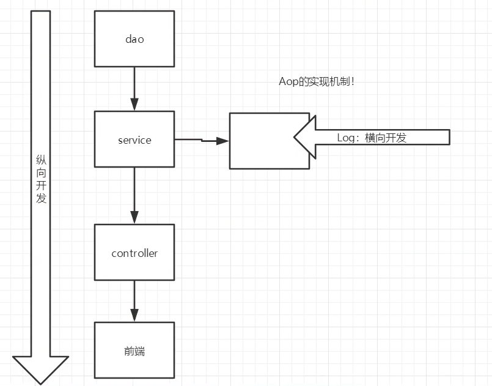
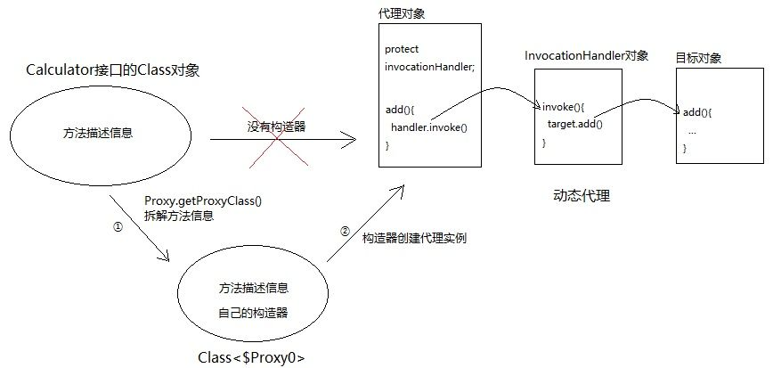

# 代理模式

[todo总结](https://www.jianshu.com/p/030cee2c8cf5)

代理模式是Spring AOP的基础！！

**核心：控制对其他对象的访问，代理类保存着实际目标类的引用对象。**

> 如果只从核心来看，传统的三层架构也是使用静态代理实现的，Controller代理Service，Service代理Dao。

代理模式：为其他对象提供一种代理，以控制对这个对象的访问。

作用：

- 保护目标对象（被代理对象）

- 增强目标对象   before after
- 解耦

缺点：

- 代理模式会造成系统设计中类的数量增加
- 在客户端和目标对象之间增加一个代理对象，会造成请求处理速度变慢； 
- 增加了系统的复杂度；

**代理模式和装饰者模式的区别**

代理模式控制访问，装饰者模式为对象加上行为。

**代理模式和适配器模式的区别**

适配器模式改变所考虑对象的接口，代理模式不能改变所代理类的接口。


## 静态代理

**静态代理角色分析**

- 抽象角色：一般使用接口或者抽象类来实现
- 真实角色：被代理的角色
- 代理角色：代理真实角色 ; 代理真实角色后 , 一般会做一些附属的操作 .
- 客户：使用代理角色来进行一些操作

### 静态代理Coding举例

被代理对象和代理对象往往要实现相同的功能，因此一般有一个抽象角色，如下图，代理角色是中介，真实角色是房东，公共实现租房接口，提供租房服务，中介为房东提供增强服务，并且限制客户对房东的访问。


**代码实现**

Rent . java 即抽象角色

```java
//抽象角色：租房
public interface Rent {
   public void rent();
}
```

Host . java 即真实角色

```java
//真实角色: 房东，房东要出租房子
public class Host implements Rent{
   public void rent() {
       System.out.println("房屋出租");
  }
}
```

Proxy . java 即代理角色

```java
//代理角色：中介
public class Proxy implements Rent {

   private Host host;
   public Proxy() { }
   public Proxy(Host host) {
       this.host = host;
  }

   //租房
   public void rent(){
       seeHouse();
       host.rent();
       fare();
  }
   //看房
   public void seeHouse(){
       System.out.println("带房客看房");
  }
   //收中介费
   public void fare(){
       System.out.println("收中介费");
  }
}
```

Client . java 即客户

```java
//客户类，一般客户都会去找代理！
public class Client {
   public static void main(String[] args) {
       //房东要租房
       Host host = new Host();
       //中介帮助房东
       Proxy proxy = new Proxy(host);

       //你去找中介！
       proxy.rent();
  }
}
```

分析：在这个过程中，你直接接触的就是中介，就如同现实生活中的样子，你看不到房东，但是你依旧通过代理租到了房东的房子，这就是所谓的代理模式。

**静态代理的好处:**

- 可以使得我们的真实角色更加纯粹，不再去关注一些公共的事情。
- 公共的业务由代理来完成，实现了业务的分工。
- 公共业务发生扩展时变得更加集中和方便。

缺点 :

- 类多了 , 多了代理类 , 工作量变大了 . 开发效率降低 .

我们想要静态代理的好处，又不想要静态代理的缺点，所以 , 就有了动态代理 !

### 通过一个静态代理例子理解Spring-AOP

1、创建一个抽象角色，比如咋们平时做的用户业务，抽象起来就是增删改查！

```java
//抽象角色：增删改查业务
public interface UserService {
   void add();
   void delete();
   void update();
   void query();
}
```

2、我们需要一个真实对象来完成这些增删改查操作

```java
//真实对象，完成增删改查操作的人
public class UserServiceImpl implements UserService {

   public void add() {
       System.out.println("增加了一个用户");
  }

   public void delete() {
       System.out.println("删除了一个用户");
  }

   public void update() {
       System.out.println("更新了一个用户");
  }

   public void query() {
       System.out.println("查询了一个用户");
  }
}
```

3、需求来了，现在我们需要增加一个日志功能，怎么实现！

- 思路1 ：在实现类上增加代码 【麻烦！每个方法都得加日志 不符合开闭原则！】
- **思路2：使用代理来做，能够不改变原来的业务情况下，实现此功能就是最好的了！**==满足开闭原则==

4、设置一个代理类来处理日志！代理角色

```java
//代理角色，在这里面增加日志的实现
public class UserServiceProxy implements UserService {
   private UserServiceImpl userService;

   public void setUserService(UserServiceImpl userService) {
       this.userService = userService;
  }

   public void add() {
       log("add");
       userService.add();
  }

   public void delete() {
       log("delete");
       userService.delete();
  }

   public void update() {
       log("update");
       userService.update();
  }

   public void query() {
       log("query");
       userService.query();
  }

   public void log(String msg){
       System.out.println("执行了"+msg+"方法");
  }

}
```

5、测试访问类：

```java
public class Client {
   public static void main(String[] args) {
       //真实业务
       UserServiceImpl userService = new UserServiceImpl();
       //代理类
       UserServiceProxy proxy = new UserServiceProxy();
       //使用代理类实现日志功能！
       proxy.setUserService(userService);

       proxy.add();
  }
}
```

OK，到了现在代理模式大家应该都没有什么问题了，重点大家需要理解其中的思想；

总结：

原有业务已经开发完毕，需要加入日志功能，可以考虑横向切入，加一层代理类，在不改变原有代码的基础上，实现新的需求。

**满足开闭原则，我们在不改变原来的代码的情况下，实现了对原有功能的增强，这是AOP中最核心的思想！**




## 动态代理

[简书：你真的完全了解Java动态代理吗？](https://www.jianshu.com/p/95970b089360)

动态代理的角色和静态代理的一样。区别：**动态代理的代理类是代码运行期间动态生成的，静态代理的代理类是我们提前写好的。**

- 动态代理分为两类 : 一类是基于接口动态代理 , 一类是基于类的动态代理

- - 基于接口的动态代理----JDK动态代理
  - 基于类的动态代理--cglib
  - 现在用的比较多的是 javasist 来生成动态代理 . 百度一下javasist


**动态代理的优点**

静态代理有的它都有，静态代理没有的，它也有！

- **一个动态代理 , 一般代理某一类业务**
- **一个动态代理可以代理多个类，代理的是接口！**


### JDK动态代理

**强烈推荐阅读：[知乎-动态代理的作用是什么](https://www.zhihu.com/question/20794107/answer/23330381)**

#### coding实例一

抽象角色和真实角色和之前的一样！

Rent . java 即抽象角色

```
//抽象角色：租房
public interface Rent {
   public void rent();
}
```

Host . java 即真实角色

```
//真实角色: 房东，房东要出租房子
public class Host implements Rent{
   public void rent() {
       System.out.println("房屋出租");
  }
}
```

ProxyInvocationHandler. java 即代理角色

```java
public class ProxyInvocationHandler implements InvocationHandler {
   private Rent rent;

   public void setRent(Rent rent) {
       this.rent = rent;
  }

   //生成代理类，重点是第二个参数，获取要代理的抽象角色！之前都是一个角色，现在可以代理一类角色
   public Object getProxy(){
       return Proxy.newProxyInstance(this.getClass().getClassLoader(),
               rent.getClass().getInterfaces(),this);
  }

   // proxy : 代理类 method : 代理类的调用处理程序的方法对象.
   // 处理代理实例上的方法调用并返回结果
   @Override
   public Object invoke(Object proxy, Method method, Object[] args) throws Throwable {
       seeHouse();
       //核心：本质利用反射实现！
       Object result = method.invoke(rent, args);
       fee();
       return result;
  }

   //看房
   public void seeHouse(){
       System.out.println("带房客看房");
  }
   //收中介费
   public void fee(){
       System.out.println("收中介费");
  }

}
```

Client . java

```
//租客
public class Client {

   public static void main(String[] args) {
       //真实角色
       Host host = new Host();
       //代理实例的调用处理程序
       ProxyInvocationHandler pih = new ProxyInvocationHandler();
       pih.setRent(host); //将真实角色放置进去！
       Rent proxy = (Rent)pih.getProxy(); //动态生成对应的代理类！
       proxy.rent();
  }

}
```

核心：**一个动态代理 , 一般代理某一类业务 , 一个动态代理可以代理多个类，代理的是接口！**

#### coding实例二

我们来使用动态代理实现代理我们后面写的UserService！

我们也可以编写一个通用的动态代理实现的类！==**代理对象可以是Object类型，任何类都可以被代理！**==

```java
public class ProxyInvocationHandler implements InvocationHandler {
   private Object target;

   public void setTarget(Object target) {
       this.target = target;
  }

   //生成代理类
   public Object getProxy(){
       return Proxy.newProxyInstance(this.getClass().getClassLoader(),
               target.getClass().getInterfaces(),this);
  }

   // proxy : 代理类
   // method : 代理类的调用处理程序的方法对象.
   public Object invoke(Object proxy, Method method, Object[] args) throws Throwable {
       log(method.getName());
       Object result = method.invoke(target, args);
       return result;
  }

   public void log(String methodName){
       System.out.println("执行了"+methodName+"方法");
  }

}
```

测试！

```java
public class Test {
   public static void main(String[] args) {
       //真实对象
       UserServiceImpl userService = new UserServiceImpl();
       //代理对象的调用处理程序
       ProxyInvocationHandler pih = new ProxyInvocationHandler();
       pih.setTarget(userService); //设置要代理的对象
       UserService proxy = (UserService)pih.getProxy(); //动态生成代理类！
       proxy.delete();  //可以换成任意方法！！！
  }
}
```

测试，增删改查，查看结果！


#### JDK动态代理原理



**JDK的动态代理的核心**

`InvocationHandler`接口，`Proxy`类，都在`java.lang.reflect`包下面。

Proxy类有一个静态方法`newProxyInstance`，传入目标对象的Classloader，接口，代理对象的`InvocationHandler`，就可以动态生成代理对象。

每一个代理对象绑定一个`InvocationHandler`，当代理对象的方法被调用时，会调用代理对象绑定的`InvocationHandler`的invoke方法，在invoke方法中调用代理对象的同名方法，并且做一些增强。

```java
public class Proxy implements java.io.Serializable {
    public static Object newProxyInstance(ClassLoader loader,
                                          Class<?>[] interfaces,
                                          InvocationHandler h);
}
```

```java
public interface InvocationHandler {
    public Object invoke(Object proxy, Method method, Object[] args)
        throws Throwable;
}
```

**具体过程：**

复制传入的接口，通过接口和类加载器，直接拼接生成字节数组class文件，然后调用native方法defineclass生成clazz对象，创建出了代理的类clazz。然后通过反射获取到代理类clazz的构造函数，通过这个构造函数new一个代理对象，构造函数的参数是InvocationHandler。当代理对象的方法被调用时，会调用InvocationHandler的invoke方法，调用目标对象的方法，并实现增强。

因为是直接生成的字节码class文件，不是很好读，源码在`package sun.misc.ProxyGenerator`下。可以参考[ProxyGenerator生成代理类的字节码文件源码分析](https://blog.csdn.net/qq_43259865/article/details/113944901)

##### invoke方法什么时候被调用的？

InvocationHandler是动态代理创建的class文件的constructor的参数，创建proxy实例的时候传入InvocationHandler，实例中实现接口的方法调用InvocationHandler的invoke方法。

可以查看Proxy中的`ProxyClassFactory`的源码，`apply`方法中调用`ProxyGenerator.generateProxyClass`方法，生成的代理对象，里面搜一下InvocationHandler。

```java
private ProxyGenerator.MethodInfo generateConstructor() throws IOException {
    ProxyGenerator.MethodInfo var1 = new ProxyGenerator.MethodInfo("<init>", "(Ljava/lang/reflect/InvocationHandler;)V", 1);
    DataOutputStream var2 = new DataOutputStream(var1.code);
    this.code_aload(0, var2);
    this.code_aload(1, var2);
    var2.writeByte(183);
    var2.writeShort(this.cp.getMethodRef("java/lang/reflect/Proxy", "<init>", "(Ljava/lang/reflect/InvocationHandler;)V"));
    var2.writeByte(177);
    var1.maxStack = 10;
    var1.maxLocals = 2;
    var1.declaredExceptions = new short[0];
    return var1;
}
```

##### 怎么只限定代理某些方法呢？

前面几个例子中，目标对象的所有方法，代理对象都能通过invoke增强，怎么能只动态代理一部分方法，而不是接口的全部方法呢？

**很简单——可以在invoke方法中对method名字做判断，选择需要增强的来增强。**


### CGLib动态代理

定义代理类实现MethodIntercept接口实现intercept方法

```java
public class CGlibProxy implements MethodInterceptor {
    private Object target;

    public <T> T getInstance(Class<T> clazz) throws IllegalAccessException, InstantiationException {
        target = clazz.newInstance();
        Enhancer enhancer = new Enhancer();
        enhancer.setSuperclass(clazz);
        enhancer.setCallback(this);
        return (T) enhancer.create();
    }

    public void before(){
        System.out.println("CGlib动态代理方法执行前...");
    }

    public void after(){
        System.out.println("CGlib动态代理方法执行后...");
    }
    @Override
    public Object intercept(Object o, Method method, Object[] objects, MethodProxy methodProxy) throws Throwable {
        before();
        Object o1 = methodProxy.invokeSuper(o, objects);
        after();
        return o1;
    }
}
```

#### CGLib动态代理原理

CGlib动态代理实际上通过继承目标类实现的，是通过ASM生成class字节码

代理类调用方法时会被拦截器拦截，最终执行methodProxy.invokeSuper方法

```java
public Object invokeSuper(Object obj, Object[] args) throws Throwable {
    try {
        init();
        FastClassInfo fci = fastClassInfo;
        return fci.f2.invoke(fci.i2, obj, args);
    }
    catch (InvocationTargetException e) {
        throw e.getTargetException();
    }
}
```

### JDK动态代理和CGlib动态代理对比

1.JDK 动态代理是实现了被代理对象的接口，CGLib 是继承了被代理对象。
 2.JDK 和 CGLib 都是在运行期生成字节码，JDK 是直接写 Class 字节码，CGLib 使用 ASM
 框架写 Class 字节码，Cglib 代理实现更复杂，生成代理类比 JDK 效率低。
 3.JDK 调用代理方法，是通过反射机制调用，CGLib 是通过 FastClass 机制直接调用方法，
 CGLib 执行效率更高。

**CGlib生成代理类效率低，执行效率高**


# 适配器模式