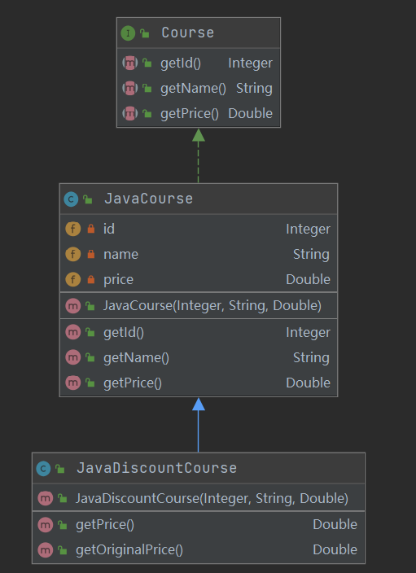
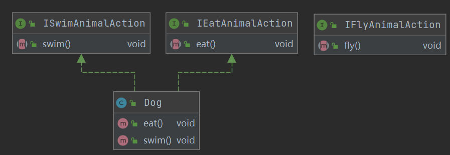

[toc]


# 七大设计原则

**框架等各种技术是“术”，设计模式这种知识是“道”。**

这 7 种设计原则是软件设计模式必须尽量遵循的原则，是设计模式的基础。在实际开发过程中，并不是一定要求所有代码都遵循设计原则，而是要综合考虑人力、时间、成本、质量，不刻意追求完美，要在适当的场景遵循设计原则。这体现的是一种平衡取舍，可以帮助我们设计出更加优雅的代码结构。

https://www.cnblogs.com/zhaye/p/11176906.html

| **设计原则**     | **一句话归纳**                                               | **目的**                                       |
| ---------------- | ------------------------------------------------------------ | ---------------------------------------------- |
| **开闭原则**     | **对扩展开放，对修改关闭**                                   | **降低维护带来的新风险**                       |
| **依赖倒置原则** | **高层不应该依赖低层，要面向接口编程**                       | **更利于代码结构的升级扩展**                   |
| **单一职责原则** | **一个类只干一件事，实现类要单一**                           | **便于理解，提高代码的可读性**                 |
| **接口隔离原则** | **一个接口只干一件事，接口要精简单一**                       | **功能解耦，高聚合、低耦合**                   |
| **迪米特法则**   | **不该知道的不要知道，一个类应该保持对其它对象最少的了解，降低耦合度** | **只和朋友交流，不和陌生人说话，减少代码臃肿** |
| **里氏替换原则** | **不要破坏继承体系，子类重写方法功能发生改变，不应该影响父类方法的含义** | **防止继承泛滥**                               |
| **合成复用原则** | **尽量使用组合或者聚合关系实现代码复用，少使用继承**         | **降低代码耦合**                               |

一般都是降低复杂性，提高可读性，可维护性，可拓展性。


## 开闭原则

> Software entities should be open for extension，but closed for modification.

开闭原则（Open Closed Principle）是编程中最基础、最重要的设计原则

一个软件实体，如类，模块和函数应该**对扩展开放（对提供方），对修改关闭（对使用方）**。**用抽象构建框架，用实现扩展细节。**

**当软件需要变化时，尽量通过扩展软件实体的行为来实现变化（新建实现类），而不是通过修改已有的代码来实现变化。**


**开闭原则的实现方法**

可以通过“抽象约束、封装变化”来实现开闭原则，即通过接口或者抽象类为软件实体定义一个相对稳定的抽象层，而将相同的可变因素封装在相同的具体实现类中。

因为抽象灵活性好，适应性广，只要抽象的合理，可以基本保持软件架构的稳定。而软件中易变的细节可以从抽象派生来的实现类来进行扩展，**即当软件需要发生变化时，只需要根据需求重新派生一个实现类来扩展就可以了。**


### 开闭原则coding举例

背景介绍：慕课网上的课程，有课程id，课程名，课程价格。课程分为各种Java、Python等多种类型。**面向接口编程，**应该先写课程的Interface，然后实现javaCourse，pythonCourse...



**新的需求：打折活动，部分课程打折。**

方法1：在Course接口中增加方法：`getDiscountPrice()`，在实现类`javaCourse()`实现方法。

这种方法有什么问题？

**接口不应该经常变化，应该是稳定且可靠的。**


方法2：不修改接口。修改需要打折的`javaCourse`类中的`getPrice()`方法：

```java
@Override 
public Double getPrice() {
    return this.price * 0.8; 
}
```

问题：只是满足了这次需求。但是如果要显式原价呢？如果后序还有优惠券呢？


**真正满足开闭原则的方法：**

新建`JavaDiscountCourse extends JavaCourse`，重写`getPrice()`，获取打折后的打折，新增`getOriginalPrice()`，获取原价。


**<font color=red>这样做的好处：</font>**

**没有修改接口和基类-对修改关闭，继承基类-对扩展开放。**不会影响接口和基类，本次需求不会影响之前的功能，并且不会影响其他模块的功能。

其他模块可能调用Course，互相依赖，如果改错了Course中的内容，会影响其他模块：团队开发是很多人共同写作的，每个人都上来改一下接口和Class，会越改越乱。而且可能一改就影响到别人的功能了，如果采用方法2，别人不知道你的修改，别人是要用Class返回原价，不就出错了么？

**对软件测试的影响：**软件遵守开闭原则的话，软件测试时只需要对扩展的代码进行测试就可以了，因为原有的测试代码仍然能够正常运行。

其他好处：

**降低维护成本：**遵守开闭原则的软件，其稳定性高和延续性强，从而易于扩展和维护。

**可以提高代码的可复用性**：粒度越小，被复用的可能性就越大；在面向对象的程序设计中，根据原子和抽象编程可以提高代码的可复用性。

<font color=blue>todo 通过BigDecimal解决丢失精度问题</font>


## 依赖倒置原则

> High level modules should not depend upon low level modules. Both should depend upon abstractions. Abstractions should not depend upon details. Details should depend upon abstractions

依赖倒置原则是实现开闭原则的重要途径之一，它降低了客户与实现模块之间的耦合。理解依赖倒置原则，对于理解Spring的依赖注入，控制反转也有很大的帮助。

依赖倒置原则的原始定义为：**高层模块不应该依赖低层模块，两者都应该依赖其抽象；抽象不应该依赖细节，细节应该依赖抽象。其核心思想是：<font color=red>要面向接口编程，不要面向实现编程。</font> 其主要目的是：降低耦合。**

高层指的是应用层Controller>Service层>DAO层

由于在软件设计中，细节具有多变性，而抽象层则相对稳定，因此以抽象为基础搭建起来的架构要比以细节为基础搭建起来的架构要稳定得多。这里的抽象指的是接口或者抽象类，而细节是指具体的实现类。

使用接口或者抽象类的目的是制定好规范和契约，而不去涉及任何具体的操作，把展现细节的任务交给它们的实现类去完成。


依赖倒置原则的主要作用如下：

- 降低修改程序所造成的风险。
- 降低类间的耦合性。
- 提高系统的稳定性。
- 提高代码的可读性和可维护性。


### 依赖倒置coding举例

一个底层对象Person，Person可以实现的功能有学习Java课程，学习Python课程，学习前端课程。

方法1：


直接在Person这个class中创建学习Java课程，学习Python课程，学习前端课程的方法。

应用层：

```java
    public static void main(String[] args) {
        Person tom = new Person();
        tom.studyGolangCourse();
        tom.studyJavaCourse();
    }
```

这就是面向实现编程，Person就是实现类，高层-应用层的依赖于底层的Person，应用层新增功能，都需要在Person类中去修改。比如想要再添加一个学习日语的功能，需要修改底层的Person。


**满足依赖倒置的写法：**

**方法1. 接口方法**


面向接口编程：用Course接口，通过实现来增加课程。将Human和课程解耦，只需要传入Course作为Human中学习课程方法的参数。具体学习什么课程交给高层模块应用层Test来选择，Human和Test之间也是解耦的。

```java
	public static void main(String[] args) {
        Human human = new Human();
        human.studyCourse(new JavaCourse());
        human.studyCourse(new PythonCourse());
    }
```


**方法2. 构造方法Setter**

方法1Human和Course是依赖关系，也可以用关联关系。即让Human类持有Course对象，相当于Spring中的@autowired注入DAO层或service层的接口。


```java
    public static void main(String[] args) {
        Human tom = new Human();
        tom.setCourse(new JavaCourse());
        tom.studyCourse();
        tom.setCourse(new PythonCourse());
        tom.studyCourse();
    }
```


这样做的好处：

Human是高层次模块，Course是低层次模块。Human这个类不依赖具体的PythonCourse或者JavaCourse，想学什么课，都可以在不动Human这个模块的前提下修改。新增课程，比如C++课程，Course也不需要动，只需要新增实现类即可，同样也满足开闭原则。


## 单一职责原则

> There should never be more than one reason for a class to change.

单一职责原则（Single Responsibility Principle，SRP）又称单一功能原则。这里的职责是指类变化的原因，单一职责原则规定一个类应该有且仅有一个引起它变化的原因，否则类应该被拆分。

**<font color = red>一个类/接口/方法只负责一项职责。</font>**

- 降低类的复杂性，提高类的可读性。
- 提高系统的可维护性。
- **降低变更引起的风险。**当修改一个功能时，可以显著降低对其他功能的影响。


实际开发中很多都不符合单一职责原则，受很多因素的影响，比如项目的规模，项目的周期，技术人员的水平，是否有Deadline等等，这些都是需要平衡的因素。而且在开发过程中面向接口编程并且非常良好地遵循单一职责原则，可能类的数量会爆炸。

因此建议在实际开发中，接口和方法尽量做到单一职责原则，类的单一职责原则看实际情况。


### 单一职责coding举例

**1. 类不遵循单一职责原则**

下面的Bird类不遵循单一职责原则，再传来一些特殊的鸟类，`mainMoveMode()`方法需要继续扩展。

```java
public class Bird {
    public void mainMoveMode(String birdName) {
        if ("鸵鸟".equals(birdName)) {
            System.out.println(birdName + "用脚走");
        } else {
            System.out.println(birdName + "用翅膀飞");
        }
    }
}
```

```java
public class Test {
	public static void main(String[] args) {
       Bird bird = new Bird();
        bird.mainMoveMode("大雁");
        bird.mainMoveMode("鸵鸟");
    }
}
```

**满足单一职责原则的写法：**

应该将鸟类细分为`FlyBird`和`WalkBird`，交由应用层决定创建什么类的鸟。如果后续新增其他类型的鸟，直接再添加新的类。

```java
/**
 * 直接将鸟类细分出WalkBird和FlyBird。
 */
public class FlyBird {
    public void mainMoveMode(String birdName) {
        System.out.println(birdName + "用翅膀飞");
    }
}
```

```java
public class WalkBird {
    public void mainMoveMode(String birdName) {
        System.out.println(birdName + "用脚走");
    }
}
```

```java
public class Test {
	public static void main(String[] args) {
        //交由应用层决定创建什么类的鸟
        FlyBird flyBird = new FlyBird();
        flyBird.mainMoveMode("大雁");

        WalkBird walkBird = new WalkBird();
        walkBird.mainMoveMode("鸵鸟");
    }
}
```

**2. 接口的单一职责**

Course接口包含以下方法：

`getCourseName()`和`getCourseVideo`是获取课程内容相关的方法，`studyCourse()`和`refundCourse()`是课程管理相关的方法。

```java
public interface Course {
    String getCourseName();
    byte[] getCourseVideo;

    void studyCourse();
    void refundCourse();
}
```

​		退课程会影响获取课程内容，退了课程就获取不到课程内容。所以这两个职责是有互相影响的，不满足单一职责原则。

**满足单一职责原则的写法：**

拆分成两个接口，一个是获取课程内容的接口，一个是管理课程的接口。

```java
/**
 * 获取课程信息的接口。
 */
public interface CourseContent {
    String getCourseName();

    byte[] getCourseVideo();
}

/**
 * 课程管理接口。
 */
public interface CourseManager {
    void studyCourse();
    void refundCourse();
}
```

然后交给实现类去具体的选择实现哪些接口，实现类可以实现一个接口，也可以实现多个接口。`public class CourseImpl implements CourseManager, CourseContent`


**3. 方法的单一职责**

对于方法来说，从命名到实现最好都是单一职责。尽量像Getter和Setter一样，一个方法只做一件事，有明确的方法名称。

```java
	//不好，命名不明确，修改了多项属性。
	private void updateUserInfo(String userName,String address){
        userName = "mkx";
        address = "beijing";
    }
	private void updateUserInfo(String userName, String... properties) {
        userName = "mkx";
		//properties...
    }

	//好，命名明确，单一职责。
	private void updateUsername(String userName){
        userName = "mkx";
    }
    private void updateUserAddress(String address){
        address = "beijing";
    }
```

以下这种也是实际开发中常见的写法，最后传入一个boolean，方法中if else判断做一些事情：

```java
	private void updateUserInfo(String userName, String address, boolean bool) {
        if (bool) {
            //todo something1
        } else {
            //todo something2
        }

        userName = "geely";
        address = "beijing";
    }
```

不推荐这种写法，从命名上就不明确，不能很好地表达单一职责。建议拆开


## 接口隔离原则

> Clients should not be forced to depend on methods they do not use. 
>
> The dependency of one class to another one should depend on the smallest possible interface

**客户端不应该被迫依赖于它不使用的方法。一个类对另一个类的依赖应该建立在最小的接口上。**

接口隔离原则（Interface Segregation Principle，ISP）要求尽量将臃肿庞大的接口拆分成更小的和更具体的接口，让接口中只包含客户感兴趣的方法。也就是说要为各个类建立它们需要的专用接口，而不要试图去建立一个很庞大的接口供所有依赖它的类去调用。

在具体应用接口隔离原则时，应该根据以下几个规则来衡量。

- 接口尽量小，但是要有限度。一个接口只服务于一个子模块或业务逻辑。
  - **注意一定要适度**，接口尽量小，但也不能太小了，不然接口的数量要爆炸，设计会很复杂。在实际的项目开发中，实践接口隔离原则的时候也要考虑业务模型，包括有可能以后会发生变更的地方。所以在设计接口的时候要多花时间去思考。
- 为依赖接口的类定制服务。只提供调用者需要的方法，屏蔽不需要的方法。
- 了解环境，拒绝盲从。每个项目或产品都有选定的环境因素，环境不同，接口拆分的标准就不同深入了解业务逻辑。
- 提高内聚，减少对外交互。使接口用最少的方法去完成最多的事情。

### 接口隔离原则coding举例

`IAnimalAction`接口定义了动物一些行为。

```java
public interface IAnimalAction {
    void eat();
    void fly();
    void swim();
}
```

对于Dog来说，如果实现这个接口，狗不会飞，也就是说必须有一个空实现放在class Dog当中。这不满足接口隔离原则。对于Bird来说，如果实现这个接口，很多鸟不会游泳，鸵鸟也不会飞。

也就是说`IAnimalAction`接口内声明的内容过多，并且是不同类型的，应该被进一步细化。

**满足接口隔离原则的写法：**




疑问：这里的接口隔离原则和上面的单一职责原则里面的接口的单一职责有什么区别吗？

接口隔离原则和单一职责都是为了提高类的内聚性、降低它们之间的耦合性，体现了封装的思想，但两者是不同的：

- **单一职责原则注重的是类、接口、方法的职责单一，而接口隔离原则注重的是对接口依赖的隔离。**
  - 在一个接口中只要职责是单一的，有多个方法也可以。例如吃，可以有很多吃法。游泳可以有很多游法。
- **单一职责原则主要是约束类、接口和方法，它针对的是程序中的实现和细节；接口隔离原则主要约束接口，主要针对抽象和程序整体框架的构建。**


**注意一定要适度！！！**


## 迪米特法则

> Talk only to your immediate friends and not to strangers.

迪米特法则（Law of Demeter，LoD）又叫作最少知识原则（Least Knowledge Principle，LKP)。

迪米特法则的定义是：**只与你的直接朋友交谈，不跟“陌生人”说话。**其含义是：如果两个软件实体无须直接通信，那么就不应当发生直接的相互调用，可以通过第三方转发该调用。其目的是**降低类之间的耦合度，提高模块的相对独立性。**

迪米特法则中的“朋友”是指：当前对象本身、当前对象的成员变量、当前对象所创建的对象、当前对象的方法参数等，而出现在方法体内部的类不属于朋友类。这些对象同当前对象存在关联、聚合或组合关系，可以直接访问这些对象的方法。